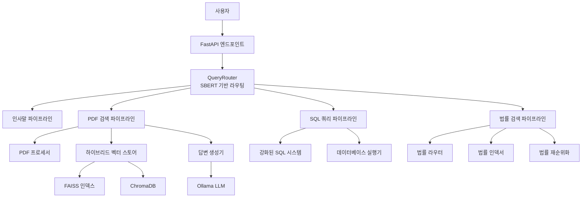

# 올라마 LLM 챗봇 프로젝트 기술 설명서

## 목차
1. [프로젝트 개요](#프로젝트-개요)
2. [시스템 아키텍처](#시스템-아키텍처)
3. [파이프라인 구조](#파이프라인-구조)
4. [핵심 모듈 분석](#핵심-모듈-분석)
5. [API 시스템](#api-시스템)
6. [기술 스택 및 기법](#기술-스택-및-기법)
7. [설치 및 실행](#설치-및-실행)

---

## 프로젝트 개요

이 프로젝트는 **올라마(Ollama) LLM 기반의 다중 파이프라인 챗봇 시스템**입니다. 다양한 유형의 질문을 자동으로 분류하고 적절한 처리 파이프라인으로 라우팅하여 정확한 답변을 제공합니다.

### 주요 특징
- **다중 파이프라인 아키텍처**: 인사말, PDF 검색, SQL 쿼리, 법률 검색 파이프라인
- **지능형 쿼리 라우팅**: SBERT 기반 자동 질문 분류
- **하이브리드 벡터 검색**: FAISS + ChromaDB 결합
- **강화된 SQL 시스템**: 동적 스키마 관리 및 하이브리드 SQL 생성
- **법률 전문 모듈**: 법률 문서 전용 검색 및 유추 시스템
- **메모리 최적화**: 효율적인 리소스 관리

---

## 시스템 아키텍처



---

## 파이프라인 구조

### 1. 인사말 파이프라인 (GREETING)
**설정 파일**: `config/pipelines/greeting_pipeline.json`

```json
{
  "pipeline_name": "GREETING",
  "description": "범용 RAG 시스템 인사말 처리 파이프라인",
  "keywords": ["안녕", "안녕하세요", "반갑습니다", "하이", "hi", "hello"]
}
```

**기능**:
- 인사말 및 일반적인 대화 처리
- 빠른 응답을 위한 캐시된 답변 시스템
- 다국어 인사말 지원

**사용 기술**:
- 키워드 매칭 기반 분류
- 사전 정의된 응답 템플릿

### 2. PDF 검색 파이프라인 (PDF_SEARCH)
**설정 파일**: `config/pipelines/pdf_pipeline.json`

**기능**:
- PDF 문서에서 텍스트 추출 및 청킹
- 의미적 유사도 기반 문서 검색
- 컨텍스트 기반 답변 생성

**사용 기술**:
- **PDF 처리**: PyPDF2, PyMuPDF, pdfplumber
- **텍스트 임베딩**: SentenceTransformer (ko-sroberta-multitask)
- **벡터 검색**: FAISS + ChromaDB 하이브리드
- **청킹 전략**: 의미 단위 기반 분할
- **키워드 추출**: TF-IDF + 코사인 유사도

### 3. SQL 쿼리 파이프라인 (SQL_QUERY)
**설정 파일**: `config/pipelines/sql_pipeline.json`

**기능**:
- 자연어 질문을 SQL 쿼리로 변환
- 동적 스키마 관리
- 쿼리 실행 및 결과 해석

**사용 기술**:
- **강화된 SQL 시스템**: 하이브리드 생성 방식
- **정보 추출**: 엔티티 인식 및 의도 분석
- **스키마 적응**: 동적 데이터베이스 스키마 관리
- **성능 모니터링**: 쿼리 실행 성능 추적

### 4. 법률 검색 파이프라인 (LEGAL_SEARCH)
**설정 파일**: `config/pipelines/legal_vector_pipeline.json`

**기능**:
- 법률 문서 전용 검색
- 조문 기반 정확한 검색
- 법률 유추 및 추론

**사용 기술**:
- **법률 스키마**: 표준화된 법률 문서 구조
- **하이브리드 인덱싱**: 벡터 + BM25 검색
- **크로스엔코더 재순위화**: 정확도 향상
- **법률 유추 엔진**: 관련 법령 추론

---

## 핵심 모듈 분석

### 1. Document 모듈 (`core/document/`)

#### PDFProcessor
**역할**: PDF 문서 처리 및 텍스트 추출
**주요 기능**:
- 다중 라이브러리를 통한 강건한 텍스트 추출
- 의미 단위 청킹
- 메타데이터 관리
- 키워드 자동 추출

**사용 기술**:
```python
# PDF 라이브러리
import PyPDF2
import fitz  # pymupdf  
import pdfplumber

# 텍스트 처리
from sentence_transformers import SentenceTransformer
from sklearn.feature_extraction.text import TfidfVectorizer
```

#### HybridVectorStore
**역할**: 하이브리드 벡터 저장 및 검색
**주요 기능**:
- FAISS와 ChromaDB 결합 사용
- 효율적인 유사도 검색
- 청크 메타데이터 관리

**사용 기술**:
```python
import faiss
import chromadb
from sklearn.metrics.pairwise import cosine_similarity
```

### 2. Query 모듈 (`core/query/`)

#### QueryRouter
**역할**: SBERT 기반 지능형 쿼리 라우팅
**주요 기능**:
- 질문 유형 자동 분류
- 파이프라인 설정 기반 라우팅
- 신뢰도 기반 결정

**사용 기술**:
```python
from sentence_transformers import SentenceTransformer
# 모델: jhgan/ko-sroberta-multitask
```

#### QuestionAnalyzer
**역할**: 질문 분석 및 임베딩 생성
**주요 기능**:
- 질문 의도 분석
- 키워드 추출
- 대화 컨텍스트 관리

### 3. LLM 모듈 (`core/llm/`)

#### AnswerGenerator
**역할**: LLM 기반 답변 생성
**주요 기능**:
- Ollama API 연동
- 컨텍스트 기반 답변 생성
- 메모리 효율적인 모델 관리

**사용 기술**:
- **Ollama 연동**: HTTP API 기반
- **모델**: qwen2:1.5b-instruct-q4_K_M
- **메모리 최적화**: 동적 로딩/언로딩

### 4. Database 모듈 (`core/database/`)

#### EnhancedSQLSystem
**역할**: 강화된 SQL 생성 및 실행 시스템
**주요 기능**:
- 하이브리드 SQL 생성 (규칙 기반 + LLM)
- 동적 스키마 관리
- 성능 모니터링

**구성 요소**:
- `EnhancedInformationExtractor`: 정보 추출
- `HybridSQLGenerator`: 하이브리드 SQL 생성
- `DynamicSchemaManager`: 스키마 관리
- `PerformanceMonitor`: 성능 추적

### 5. Legal 모듈 (`core/legal/`)

#### LegalRouter
**역할**: 법률 검색 통합 라우터
**주요 기능**:
- 법률 모드별 처리
- 정확도/탐색/유추 모드 지원

**구성 요소**:
- `LegalSchema`: 법률 문서 표준화
- `LegalChunker`: 조문 기준 청킹
- `LegalIndexer`: 하이브리드 인덱싱
- `LegalRetriever`: 검색 최적화
- `LegalReranker`: 크로스엔코더 재순위화
- `LawInference`: 법률 유추 엔진

### 6. Utils 모듈 (`core/utils/`)

#### MemoryOptimizer
**역할**: 메모리 사용량 최적화
**주요 기능**:
- 모델 메모리 관리
- 동적 리소스 할당
- 가비지 컬렉션 최적화

#### SingletonManager
**역할**: 싱글톤 패턴 기반 리소스 관리
**주요 기능**:
- 임베딩 모델 공유
- 캐시 시스템 관리

---

## API 시스템

### FastAPI 엔드포인트 (`api/endpoints.py`)

**주요 엔드포인트**:

#### 1. 질문 처리 API
```http
POST /ask
Content-Type: application/json

{
  "question": "사용자 질문",
  "pdf_id": "문서 ID (선택사항)",
  "user_id": "사용자 ID (선택사항)",
  "use_conversation_context": true,
  "max_chunks": 5
}
```

#### 2. PDF 업로드 API
```http
POST /upload-pdf
Content-Type: multipart/form-data

file: PDF 파일
```

#### 3. 시스템 상태 API
```http
GET /status
```

### 클라이언트 라이브러리

#### Django 클라이언트 (`api/django_client.py`)
```python
from api.django_client import PDFQAClient

client = PDFQAClient("http://localhost:8000")
response = client.ask_question("질문 내용")
```

#### TypeScript 클라이언트 (`api/typescript_client.ts`)
```typescript
import { PDFQAClient } from './typescript_client';

const client = new PDFQAClient('http://localhost:8000');
const response = await client.askQuestion('질문 내용');
```

---

## 기술 스택 및 기법

### 1. 머신러닝 및 AI
- **LLM**: Ollama (qwen2:1.5b-instruct-q4_K_M)
- **임베딩**: SentenceTransformer (ko-sroberta-multitask)
- **벡터 검색**: FAISS, ChromaDB
- **텍스트 처리**: TF-IDF, 코사인 유사도

### 2. 백엔드 프레임워크
- **API**: FastAPI
- **비동기 처리**: Python asyncio
- **데이터베이스**: SQLite (기본), 확장 가능

### 3. 문서 처리
- **PDF 처리**: PyPDF2, PyMuPDF, pdfplumber
- **텍스트 전처리**: 정규표현식, 한국어 토큰화

### 4. 성능 최적화
- **메모리 관리**: 동적 모델 로딩/언로딩
- **캐시 시스템**: 질문-답변 캐시
- **병렬 처리**: 멀티스레딩

### 5. 설계 패턴
- **싱글톤 패턴**: 리소스 공유
- **팩토리 패턴**: 모듈 생성
- **옵저버 패턴**: 상태 모니터링
- **전략 패턴**: 파이프라인 선택

---

## 설치 및 실행

### 1. 환경 설정
```bash
# 의존성 설치
pip install -r requirements.txt

# Ollama 설치 및 모델 다운로드
ollama pull qwen2:1.5b-instruct-q4_K_M
```

### 2. 실행 방법

#### 로컬 테스트
```bash
python main.py
```

#### API 서버 실행
```bash
python run_server.py
```

#### Docker 실행
```bash
docker build -t chatbot .
docker run -p 8000:8000 chatbot
```

### 3. 설정 파일
- `config/pipelines/`: 파이프라인 설정
- `core/config/unified_config.py`: 통합 설정 관리

### 4. 로그 및 모니터링
- `logs/`: 각종 로그 파일
- `utils/performance_monitor.py`: 성능 모니터링

---

## 결론

이 프로젝트는 현대적인 AI 기술과 소프트웨어 엔지니어링 모범 사례를 결합한 종합적인 챗봇 시스템입니다. 모듈화된 아키텍처, 지능형 라우팅, 그리고 다양한 도메인별 전문 처리 능력을 통해 확장 가능하고 유지보수가 용이한 시스템을 구현했습니다.

주요 혁신 사항:
- **다중 파이프라인 아키텍처**로 다양한 질문 유형 대응
- **하이브리드 검색 시스템**으로 정확도와 성능 동시 확보
- **법률 전문 모듈**로 도메인 특화 기능 제공
- **메모리 최적화**로 효율적인 리소스 사용
- **종합적인 API 시스템**으로 다양한 클라이언트 지원

이 시스템은 기업용 문서 검색, 법률 자문, 데이터 분석 등 다양한 실무 환경에서 활용할 수 있는 강력한 도구입니다.
